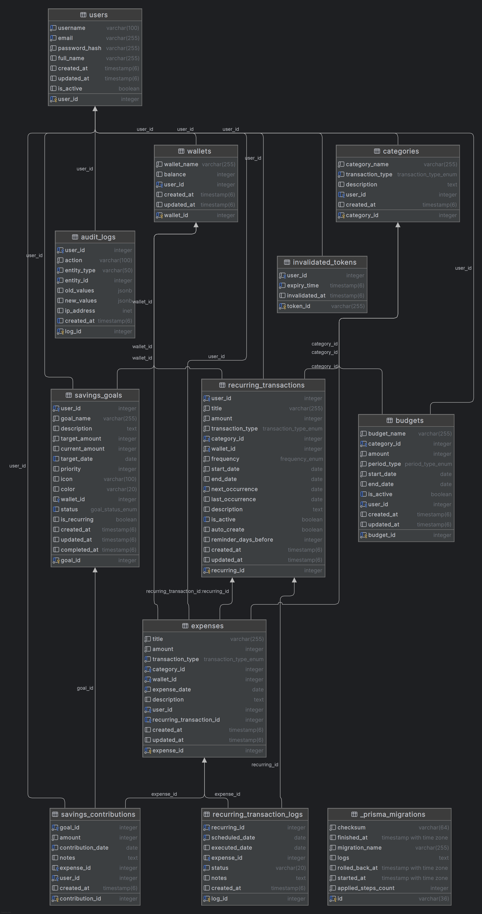

**Truy cập swagger qua port :  localhost:3000/api**

## Health Check Endpoints

The application includes comprehensive health check endpoints using NestJS Terminus:

### Available Endpoints:

- **`GET /health`** - Complete health check (database, Redis, memory)
- **`GET /health/ready`** - Readiness probe (database + Redis availability)
- **`GET /health/live`** - Liveness probe (memory check)

### Health Checks Include:
- ✅ **Database (PostgreSQL)** - Prisma connection status
- ✅ **Redis** - Cache and queue connectivity
- ✅ **Memory** - Heap and RSS usage monitoring

### Example Response:
```json
{
  "status": "ok",
  "info": {
    "database": { "status": "up" },
    "redis": { "status": "up" },
    "memory_heap": { "status": "up" },
    "memory_rss": { "status": "up" }
  }
}
```

For detailed documentation, see [src/health/README.md](src/health/README.md)


